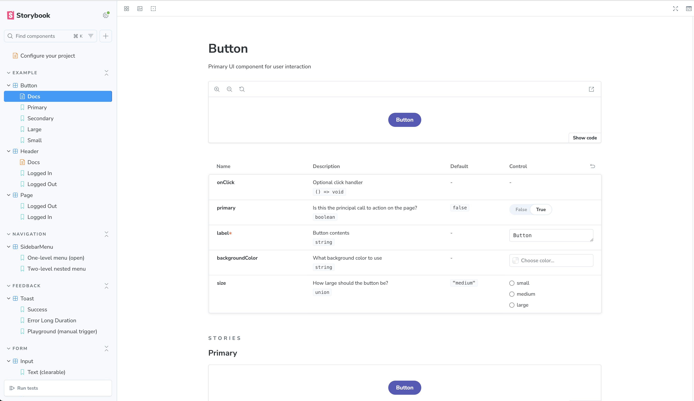

# React Component Library with Storybook
This project is a small **React + TypeScript** component library built with **Vite** and documented
in **Storybook**.
It implements three reusable UI components:
- a smart `Input`
- a `Toast` notification
- a nested `SidebarMenu`
All components are demonstrated in Storybook with different states and props, following the **Single
Responsibility Principle**: each component is responsible for a small piece of UI and its own
behaviour.
---
## Tech stack
- **React** + **TypeScript**
- **Vite** – dev server & build
- **Storybook 10** with Vite builder
- **ESLint + Prettier** – code quality & formatting
- **Vitest + Playwright** – via Storybook addon (for visual/interaction tests)
---
## Getting started
Install dependencies:
```bash
npm install
```
Run Storybook:
```bash
npm run storybook
```
Storybook will be available at: **http://localhost:6006**
Other useful scripts:
```bash
npm run dev # Vite dev server
npm run build # Production build
npm run build-storybook
npm run lint # ESLint
npm run format # Prettier format
npm run format:check # Prettier check
```
---
## Project structure
```text
src/
 components/
 Input/
 Input.tsx
 Input.css
 Toast/
 Toast.tsx
 Toast.css
 SidebarMenu/
 SidebarMenu.tsx
 SidebarMenu.css
 stories/
 Input.stories.tsx
 Toast.stories.tsx
 SidebarMenu.stories.tsx
 index.ts
```
- `components/*` – UI components + styles
- `stories/*` – Storybook stories that document and showcase different states
All public exports go through `src/index.ts`:
```ts
export { default as Input } from "./components/Input/Input";
export { default as Toast } from "./components/Toast/Toast";
export { default as SidebarMenu } from "./components/SidebarMenu/SidebarMenu";
```
---
# Components
## Input
### Responsibility
Configurable text input component with:
- multiple types
- password visibility toggle
- optional clear button
- error state
### Key props
- `type?: "text" | "password" | "number" | "email"` (default: `"text"`)
- `value: string` – controlled value
- `onChange: (value: string) => void`
- `label?: string`
- `clearable?: boolean`
- `error?: string`
- ■■■■ ■■■■ ■■■■■■■■■■ `<input>` props
### Behaviour
- If `type="password"` – shows an eye icon button to toggle visibility.
- If `clearable` and there is a value – shows a small `×` button to clear input.
- When `error` is set – input border turns red and error text is displayed.
### Storybook
Group: **Form / Input**
Stories:
- **Text (clearable)** – text input with clear button
- **Password with toggle** – password input with visibility toggle
- **Number** – numeric input
---
## Toast
### Responsibility
Small notification that appears in the bottom-right corner and hides automatically after a given
duration.
### Key props
- `message: string`
- `type?: "success" | "error" | "info" | "warning"` (default: `"info"`)
- `duration?: number` – ms before auto-dismiss (default: `3000`)
- `onClose?: () => void`
- `showCloseButton?: boolean` – show manual close `×` (default: `true`)
### Behaviour
- Renders fixed at the bottom-right of the viewport.
- Uses a simple fade/slide-in animation.
- Automatically hides after `duration` ms and calls `onClose` if provided.
- Can also be closed manually via the close button.
### Storybook
Group: **Feedback / Toast**
Stories:
- **Success** – short duration success message
- **Error Long Duration** – error toast with longer duration
- **Playground (manual trigger)** – button that shows toast and lets you play with controls.
---
## SidebarMenu
### Responsibility
Right-sliding sidebar menu with optional nested items (1–2 levels) and backdrop click to close.
### Types
```ts
export interface SidebarMenuItem {
 id: string;
 label: string;
 children?: SidebarMenuItem[];
 onClick?: () => void;
}
export interface SidebarMenuProps {
 isOpen: boolean;
 onClose: () => void;
 items: SidebarMenuItem[];
 title?: string;
}
```
### Behaviour
- When `isOpen` is `true`, a dark overlay is shown and the panel slides in from the right.
- Clicking on the overlay calls `onClose` and closes the sidebar.
- Items with `children` act as accordion sections:
 - first click toggles open/closed state
 - nested items are rendered as an indented list.
### Storybook
Group: **Navigation / SidebarMenu**
Stories:
- **One-level menu (open)** – flat list of items
- **Two-level nested menu** – items with nested children and expandable sections
---
## Storybook organization
Stories are organized into high-level groups:
- **Form / Input**
- **Feedback / Toast**
- **Navigation / SidebarMenu**
Each story shows different prop configurations and component states to make it easy to review
behaviour without touching the code.
---
## Screenshots
Screenshots are stored in the `screenshots/` folder and show the requested states from the
assignment:
- Input component
- Toast component
- Sidebar menu
- Storybook UI

### Input component


### Toast component


### Sidebar menu


### Storybook UI



### Toast (error state)


### Sidebar menu (two-level)


---
## Notes on Single Responsibility
Each component focuses on a single responsibility:
- `Input` – controlled text input with small UX helpers (toggle + clear).
- `Toast` – showing and dismissing notifications.
- `SidebarMenu` – managing open/close state of a sliding menu and nested items.
Stories are responsible only for documentation and examples, not for component logic.
This separation makes the library easy to understand, test and extend.

### Bonus: React Hook Form integration

The story **“Form / Input with React Hook Form / Email field with validation”** shows how the `Input` component works as a controlled field inside `react-hook-form` using the `Controller` API and built-in validation.